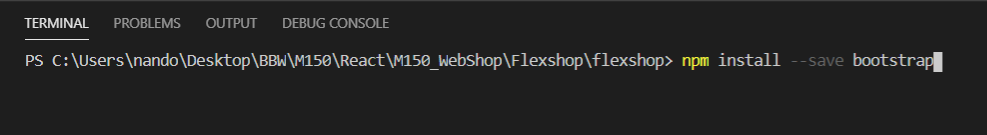
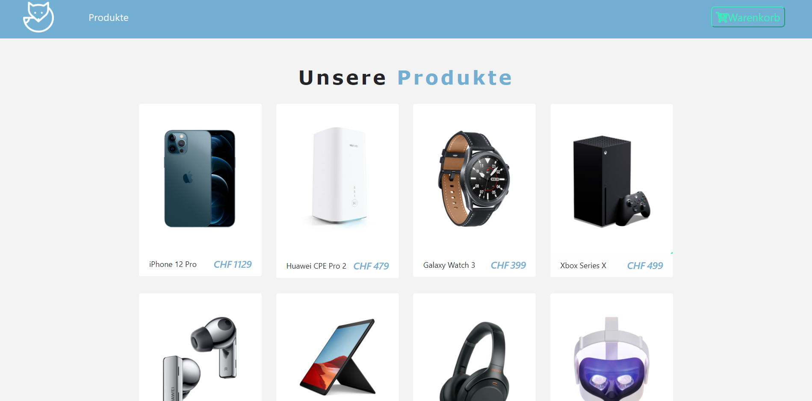
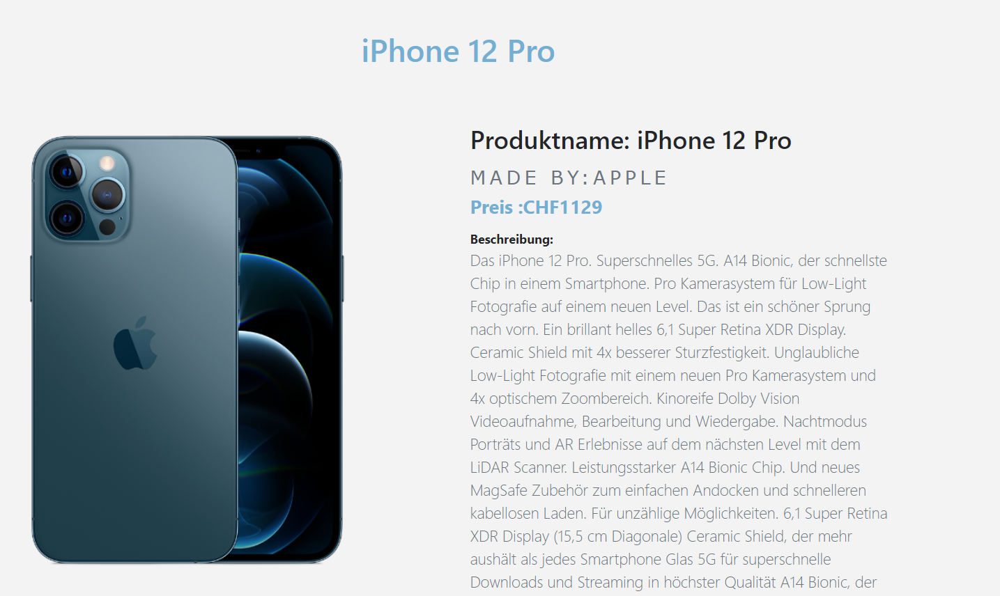
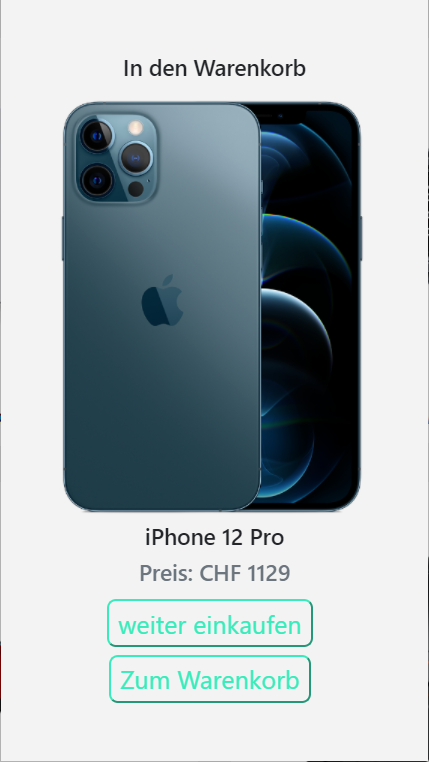
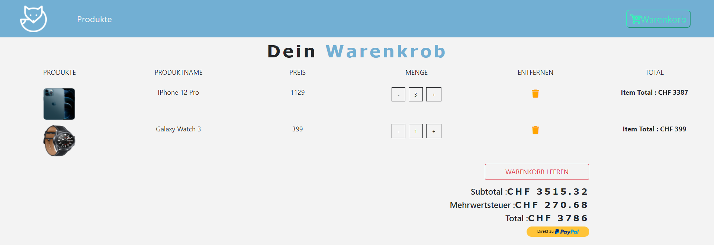

# M150_WebShop

## Dokumentation

Gruppe : Shramdeep, Sven, Nando

Bootstrap installation:
- "npm install --save bootstrap" in Terminal

<br>

### Produkt Liste (ProduktList.js)

In dieser File werden die Produkte gemappt und als Teil der Hauptseite gerendert. Die Produkte werden vom Produkt.js per "id" geholt.
```javascript
import React, { Component } from 'react'
import Produkt from "./Produkt";
import Title from './Title';
import {ProductConsumer} from '../context';

export default class ProduktList extends Component {

    render() {
        return (
            <React.Fragment>
                <div className="py-5">
                    <div className="container">
                        <Title name="Unsere"  title="Produkte" />
                        <div className="row">
                            <ProductConsumer>
                                {
                                    value => {
                                        return value.products.map(product =>{
                                            return <Produkt key={product.id} 
                                            product={product}/>;
                                        
                                        })
                                    }
                                }
                            </ProductConsumer>
                        </div>
                    </div>

                </div>
            </React.Fragment>
            //    <Produkt/>
            
        )
    }
}
```
<br>
Resultat im Browser:
<br>


<br>

### Produkt (Produkt.js)

Jede Produktkarte die in der Produktliste erscheinen werden in Produkt.js erstellt. Somit wird im Produkt.js der Layout für die Karten erstellt. Das schliesst ein, der grünen Warenkorb-Knopf der Zustand wechselt, wenn das Produkt im Warenkorb hinzugefügt wure oder nicht.
```javascript
import React, { Component } from "react";
import styled from "styled-components";
import {Link} from "react-router-dom";
import { ProductConsumer } from "../context";
import PropTypes from 'prop-types';

export default class Produkt extends Component {
    render() {
        const {id , title, img, price, inCart} = this.props.product;
        return (
            <ProductWrapper className="col-9 mx-auto col-md-6 col-lg-3 my-3">
                <div className="card">
                    <ProductConsumer>
                        {(value) => (
                            <div className="img-container p-5" 
                            onClick={() => 
                            value.handleDetail(id)}>

                                <Link to="/details">
                                
                                </Link>

                                <button className="cart-btn" 
                                disabled={inCart ? true : false}
                                onClick={() => {
                                    value.addToCart(id);
                                    value.openModal(id);
                                }}>
                                        
                                {inCart?(
                                <p className="text-capitalize mb-0" disabled>
                                    {" "}
                                    Im Warenkorb
                                </p>
                                ):(
                                    <i className="fas fa-cart-plus"/>
                                    )}
                                </button>
                            </div>
                        )}
                        
                    </ProductConsumer>
                    {/* Card footer */}
                    <div className="card-footer d-flex justify-content-between">
                        <p className="align-self-center mb-0">
                            {title}
                        </p>
                        <h5 className="text-blue font-italic mb-0">
                            <span className="mr-1">CHF</span>
                            {price}
                        </h5>
                    </div>
                </div>
                
            </ProductWrapper>
        )
    }
}

ProductConsumer.propTypes ={
    product:PropTypes.shape({
        id:PropTypes.number,
        img:PropTypes.string,
        title:PropTypes.string,
        price:PropTypes.number,
        inCart:PropTypes.bool
    }).isRequired
}
```
<br>
Resultat im Browser:
<br>


<br>

### Produkt Details (Details.js)

Wenn man auf ein Produkt in der Produktliste druckt, werden die Informationen über das Produkt dargestellt. 

```javascript
import React, { Component } from 'react';
import { ProductConsumer } from '../context';
import { Link } from 'react-router-dom';
import { ButtonContainer } from './Button';

export default class Details extends Component {
    render() {
        return (
            <ProductConsumer>
        {value => {
            const {id,company,img,info,price,title,inCart} 
            = value.detailProduct;
            return(
                <div className="container py-5">
                    {/*Title*/}
                    <div className="row">
                        <div className="col-10 mx-auto text-center text-slanted text-blue my-5">
                            <h1>{title}</h1>
                        </div>
                    </div>
                    {/*Produkt info*/}
                    <div className="row">
                        <div className="col-10 mx-auto col-md-6 my-3">
                            
                        </div>
                        {/*Produkt text*/}
                        <div className="col-10 mx-auto col-md-6 my-3">
                                {/*Produkt Name*/}
                            <h2>Produktname: {title}</h2>  
                                {/*Produkt Hersteller*/}
                            <h4 className="text-title text-uppercase text-muted mt-3 mb-2">
                                made by: 
                                <span className="text-uppercase">
                                {company}
                                </span>
                            </h4>
                            {/*Produkt Preis*/}
                            <h4 className="text-blue">
                                <strong>
                                    Preis : 
                                    <span>
                                        CHF
                                    </span>
                                    {price}
                                </strong>
                            </h4>
                            {/*Produkt Beschreibung*/}
                            <p className=" font-weight-bold mt-3 mb-0">
                            Beschreibung:
                            </p>
                            <p className="text-muted lead">
                                {info}
                            </p>
                            {/*Buttons*/}
                            <div>
                                <Link to="/">
                                <ButtonContainer>
                                    zurück zur Produktliste
                                </ButtonContainer>
                                </Link>
                                <ButtonContainer cart 
                                disabled={inCart?true:false}
                                onClick={()=>{
                                    value.addToCart(id);
                                    value.openModal(id);
                                
                                }}>
                                    {inCart?"Im Warenkorb" : "In den Warenkorb"}
                                </ButtonContainer>
                            </div>
                        </div>    
                    </div>
                </div>
            )
            }
        }
        </ProductConsumer>
        );
    }
}
```


<br>
Resultat im Browser:
<br>


<br>

### Modal (Modal.js)

Ein kleinen Fenster der erscheint, wenn man ein Produkt in dem Warenkorb einfügt. 
```javascript
import React, { Component } from 'react';
import styled from 'styled-components';
import  {ProductConsumer} from '../context';
import {ButtonContainer} from "./Button";
import {Link} from 'react-router-dom';

export default class Modal extends Component {
    render() {
        return (
            <div>
                <ProductConsumer>
                    {(value) =>{
                        const {modalOpen,closeModal} = value;
                        const {img, title, price} = value.modalProduct;
                        if(!modalOpen){
                            return null;
                        }else{
                            return (
                                <ModalContainer>
                                    <div className="container">
                                        <div className="row">
                                            <div id="modal" className="col-8 mx-auto col-md-6 col-lg-4 text-center p-5">
                                                <h5>In den Warenkorb</h5>
                                                
                                                <h5>{title}</h5>
                                                <h5 className="text-muted">Preis: CHF {price}</h5>
                                                <Link to='/'>
                                                    <ButtonContainer onClick={()=>closeModal()}>
                                                        weiter einkaufen
                                                    </ButtonContainer>
                                                </Link>
                                                <Link to='/cart'>
                                                    <ButtonContainer onClick={()=>closeModal()}>
                                                        Zum Warenkorb
                                                    </ButtonContainer>
                                                </Link>
                                            </div>
                                        </div>
                                    </div>
                                </ModalContainer>
                            );
                        }
                    }}
                </ProductConsumer>
            </div>
        );
    }
}
```

<br>
Resultat im Browser:
<br>


<br>

### Cart (Cart.js)

Im Warenkorb(Cart) wird die Warenkorbliste und das Total vom Preis von alle Produkte in dem Warenkorb eingefügt. Es rendert die List von Produkte die im Warenkorb eingefügt wurden. Dazu wird jedes Mal der gesamt Preis von alle Produkte angezeigt. Der Preis vom Produkt vor Mehrwertsteuern, die gesamte Mehrwertsteuer von alle Produkte im Warenkorb und Schlussendlich die zu bezahlende Menge, werden unter der Warenkorbliste angezeigt.
```javascript
import React, { Component } from 'react';
import Title from '../Title';
import CartColumns from './CartColumns';
import EmptyCart from './EmptyCart';
import {ProductConsumer} from '../../context';
import CartList from './CartList';
import CartTotals from './CartTotals';

export default class Cart extends Component {
    render() {
        return (
            <section>
                <ProductConsumer>
                    {value =>{
                        const {cart} = value;
                        if(cart.length>0){
                            return(
                                <React.Fragment>
                                <Title name="dein" title="warenkrob"/>
                                <CartColumns/>
                                <CartList value={value}/>
                                <CartTotals value={value}/>
                                </React.Fragment>
                            );
                        }else{
                            return <EmptyCart/>;
                        }
                    }}
                </ProductConsumer>

            </section>

        )
    }
}
```

<br>
Resultat im Browser:
<br>


<br>


