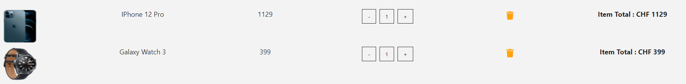
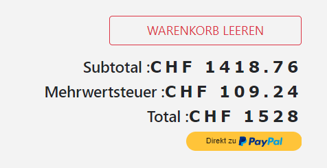
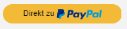

# M150_WebShop

## Dokumentation

Gruppe : Shramdeep, Sven, Nando

Bootstrap installation:
- "npm install --save bootstrap" in Terminal

<br>

### Produkt Liste (ProduktList.js)

In dieser File werden die Produkte gemappt und als Teil der Hauptseite gerendert. Die Produkte werden vom Produkt.js per "id" geholt.
```javascript
import React, { Component } from 'react'
import Produkt from "./Produkt";
import Title from './Title';
import {ProductConsumer} from '../context';

export default class ProduktList extends Component {

    render() {
        return (
            <React.Fragment>
                <div className="py-5">
                    <div className="container">
                        <Title name="Unsere"  title="Produkte" />
                        <div className="row">
                            <ProductConsumer>
                                {
                                    value => {
                                        return value.products.map(product =>{
                                            return <Produkt key={product.id} 
                                            product={product}/>;
                                        
                                        })
                                    }
                                }
                            </ProductConsumer>
                        </div>
                    </div>

                </div>
            </React.Fragment>
            //    <Produkt/>
            
        )
    }
}
```
<br>
Resultat im Browser:
<br>


<br>

### Produkt (Produkt.js)

Jede Produktkarte die in der Produktliste erscheinen werden in Produkt.js erstellt. Somit wird im Produkt.js der Layout für die Karten erstellt. Das schliesst ein, der grünen Warenkorb-Knopf der Zustand wechselt, wenn das Produkt im Warenkorb hinzugefügt wure oder nicht.
```javascript
import React, { Component } from "react";
import styled from "styled-components";
import {Link} from "react-router-dom";
import { ProductConsumer } from "../context";
import PropTypes from 'prop-types';

export default class Produkt extends Component {
    render() {
        const {id , title, img, price, inCart} = this.props.product;
        return (
            <ProductWrapper className="col-9 mx-auto col-md-6 col-lg-3 my-3">
                <div className="card">
                    <ProductConsumer>
                        {(value) => (
                            <div className="img-container p-5" 
                            onClick={() => 
                            value.handleDetail(id)}>

                                <Link to="/details">
                                
                                </Link>

                                <button className="cart-btn" 
                                disabled={inCart ? true : false}
                                onClick={() => {
                                    value.addToCart(id);
                                    value.openModal(id);
                                }}>
                                        
                                {inCart?(
                                <p className="text-capitalize mb-0" disabled>
                                    {" "}
                                    Im Warenkorb
                                </p>
                                ):(
                                    <i className="fas fa-cart-plus"/>
                                    )}
                                </button>
                            </div>
                        )}
                        
                    </ProductConsumer>
                    {/* Card footer */}
                    <div className="card-footer d-flex justify-content-between">
                        <p className="align-self-center mb-0">
                            {title}
                        </p>
                        <h5 className="text-blue font-italic mb-0">
                            <span className="mr-1">CHF</span>
                            {price}
                        </h5>
                    </div>
                </div>
                
            </ProductWrapper>
        )
    }
}

ProductConsumer.propTypes ={
    product:PropTypes.shape({
        id:PropTypes.number,
        img:PropTypes.string,
        title:PropTypes.string,
        price:PropTypes.number,
        inCart:PropTypes.bool
    }).isRequired
}
```
<br>
Resultat im Browser:
<br>


<br>

### Produkt Details (Details.js)

Wenn man auf ein Produkt in der Produktliste druckt, werden die Informationen über das Produkt dargestellt. 

```javascript
import React, { Component } from 'react';
import { ProductConsumer } from '../context';
import { Link } from 'react-router-dom';
import { ButtonContainer } from './Button';

export default class Details extends Component {
    render() {
        return (
            <ProductConsumer>
        {value => {
            const {id,company,img,info,price,title,inCart} 
            = value.detailProduct;
            return(
                <div className="container py-5">
                    {/*Title*/}
                    <div className="row">
                        <div className="col-10 mx-auto text-center text-slanted text-blue my-5">
                            <h1>{title}</h1>
                        </div>
                    </div>
                    {/*Produkt info*/}
                    <div className="row">
                        <div className="col-10 mx-auto col-md-6 my-3">
                            
                        </div>
                        {/*Produkt text*/}
                        <div className="col-10 mx-auto col-md-6 my-3">
                                {/*Produkt Name*/}
                            <h2>Produktname: {title}</h2>  
                                {/*Produkt Hersteller*/}
                            <h4 className="text-title text-uppercase text-muted mt-3 mb-2">
                                made by: 
                                <span className="text-uppercase">
                                {company}
                                </span>
                            </h4>
                            {/*Produkt Preis*/}
                            <h4 className="text-blue">
                                <strong>
                                    Preis : 
                                    <span>
                                        CHF
                                    </span>
                                    {price}
                                </strong>
                            </h4>
                            {/*Produkt Beschreibung*/}
                            <p className=" font-weight-bold mt-3 mb-0">
                            Beschreibung:
                            </p>
                            <p className="text-muted lead">
                                {info}
                            </p>
                            {/*Buttons*/}
                            <div>
                                <Link to="/">
                                <ButtonContainer>
                                    zurück zur Produktliste
                                </ButtonContainer>
                                </Link>
                                <ButtonContainer cart 
                                disabled={inCart?true:false}
                                onClick={()=>{
                                    value.addToCart(id);
                                    value.openModal(id);
                                
                                }}>
                                    {inCart?"Im Warenkorb" : "In den Warenkorb"}
                                </ButtonContainer>
                            </div>
                        </div>    
                    </div>
                </div>
            )
            }
        }
        </ProductConsumer>
        );
    }
}
```


<br>
Resultat im Browser:
<br>


<br>

### Modal (Modal.js)

Ein kleinen Fenster der erscheint, wenn man ein Produkt in dem Warenkorb einfügt. 
```javascript
import React, { Component } from 'react';
import styled from 'styled-components';
import  {ProductConsumer} from '../context';
import {ButtonContainer} from "./Button";
import {Link} from 'react-router-dom';

export default class Modal extends Component {
    render() {
        return (
            <div>
                <ProductConsumer>
                    {(value) =>{
                        const {modalOpen,closeModal} = value;
                        const {img, title, price} = value.modalProduct;
                        if(!modalOpen){
                            return null;
                        }else{
                            return (
                                <ModalContainer>
                                    <div className="container">
                                        <div className="row">
                                            <div id="modal" className="col-8 mx-auto col-md-6 col-lg-4 text-center p-5">
                                                <h5>In den Warenkorb</h5>
                                                
                                                <h5>{title}</h5>
                                                <h5 className="text-muted">Preis: CHF {price}</h5>
                                                <Link to='/'>
                                                    <ButtonContainer onClick={()=>closeModal()}>
                                                        weiter einkaufen
                                                    </ButtonContainer>
                                                </Link>
                                                <Link to='/cart'>
                                                    <ButtonContainer onClick={()=>closeModal()}>
                                                        Zum Warenkorb
                                                    </ButtonContainer>
                                                </Link>
                                            </div>
                                        </div>
                                    </div>
                                </ModalContainer>
                            );
                        }
                    }}
                </ProductConsumer>
            </div>
        );
    }
}
```

<br>
Resultat im Browser:
<br>


<br>

### Cart (Cart.js)

Im Warenkorb(Cart) wird die Warenkorbliste und das Total vom Preis von alle Produkte in dem Warenkorb eingefügt. Es rendert die List von Produkte die im Warenkorb eingefügt wurden. Dazu wird jedes Mal der gesamt Preis von alle Produkte angezeigt. Der Preis vom Produkt vor Mehrwertsteuern, die gesamte Mehrwertsteuer von alle Produkte im Warenkorb und Schlussendlich die zu bezahlende Menge, werden unter der Warenkorbliste angezeigt.
```javascript
import React, { Component } from 'react';
import Title from '../Title';
import CartColumns from './CartColumns';
import EmptyCart from './EmptyCart';
import {ProductConsumer} from '../../context';
import CartList from './CartList';
import CartTotals from './CartTotals';

export default class Cart extends Component {
    render() {
        return (
            <section>
                <ProductConsumer>
                    {value =>{
                        const {cart} = value;
                        if(cart.length>0){
                            return(
                                <React.Fragment>
                                <Title name="dein" title="warenkrob"/>
                                <CartColumns/>
                                <CartList value={value}/>
                                <CartTotals value={value}/>
                                </React.Fragment>
                            );
                        }else{
                            return <EmptyCart/>;
                        }
                    }}
                </ProductConsumer>

            </section>

        )
    }
}
```

<br>
Resultat im Browser:
<br>


<br>

### CartItem (CartItem.js)

Da wird das Layout für alle Produkte, die im Warenkorb sind, erstellt.

```javascript
import React from 'react';

export default function CartItem({item,value}) {
    
    const {id, title, img, price, total, count} = item;
    const {increment, decrement, removeItem} = value;

    return (
        <div className="row my-2 text-capitalize text-center">
            <div className="col-10 my-auto col-lg-2">
                

            </div>
            <div className="col-10 mx-auto col-lg-2">
                <span className="d-lg-none">produkt : </span>
                {title}
            </div>
            <div className="col-10 mx-auto col-lg-2">
                <span className="d-lg-none">preis : </span>
                {price}
            </div>
            <div className="col-10 mx-auto col-lg-2 my-lg-0">
                <div className="d-flex justify-content-center">
                    <div>
                        {/*Decrement*/}
                        <span className="btn btn-black mx-1" onClick={()=>decrement(id)}>
                            -
                        </span>
                        {/*Count*/}
                        <span className="btn btn-black mx-1">{count}</span>
                        {/*Increment*/}
                        <span className="btn btn-black mx-1" onClick={()=>increment(id)}>
                            +
                        </span>
                    </div>
                </div>
            </div>
            {/*Löschen*/}
            <div className="col-10 mx-auto col-lg-2">
                <div className="cart-icon" onClick={()=>removeItem(id)}>
                    <i className="fas fa-trash"></i>
                </div>
            </div>
            {/*Total Preis*/}
            <div className="col-10 mx-auto col-lg-2">
                <span className="d-lg-none">total : </span>
                <strong>item total : CHF {total}</strong>
            </div>
        </div>
    )
}
```

<br>
Resultat im Browser:
<br>


<br>

### Total  (CartTotals.js)
Zeigt der Preis vor Mehrwehrtsteuer, die Mehrwehrtsteuer und der BruttoPreis. Zusätzlich, wurden zwei Knöpfe hinzugefügt. Ein Knopf kann der ganzen Warenkorb leeren und der zweiten Knopf ist damit man die Produkte schlussendlich mit PayPal bezahlt werden kann.

```javascript
import React from 'react';
import {Link} from 'react-router-dom';
import PayPalButton from './PayPalButton';


export default function CartTotals({value, history}) {
     
    const {cartSubTotal, cartTax, cartTotal, clearCart} = value;

    return (
        <React.Fragment>
            <div className="container">
                <div className="row">
                    <div className="col-10 mt-2 ml-sm-5 ml-md-auto col-sm-8 text-capitalize text-right">
                        <Link to="/">
                            <button className="btn btn-outline-danger text-uppercase mb-3 px-5" 
                            type="button"
                            onClick={()=>clearCart()}>
                                Warenkorb leeren
                            </button>
                        </Link>
                        <h5>
                            Subtotal :
                            <span className="text-title">
                                <strong>
                                    CHF {cartSubTotal}
                                </strong>
                            </span>
                        </h5>
                        <h5>
                            Mehrwertsteuer :
                            <span className="text-title">
                                <strong>
                                    CHF {cartTax}
                                </strong>
                            </span>
                        </h5>
                        <h5>
                            Total :
                            <span className="text-title">
                                <strong>
                                    CHF {cartTotal}
                                </strong>
                            </span>
                        </h5>
                        <PayPalButton total={cartTotal} clearCart={clearCart} history={history}/>
                    </div>
                </div>
            </div>
        </React.Fragment>
        
    )
}

```

<br>
Resultat im Browser:
<br>


<br>

### Daten (data.js)

Im "data.js" sind alle Daten von die einzelne Produkte als Objekte aufgelistet.

<br>

### Context File (context.js)

Im "context.js" sind alle Funktion die um die ganze Appilkation beutzt werden.
```javascript
import React, { Component } from 'react';
import {storeProducts, detailProduct} from './data';

const ProductContext = React.createContext();
//Provider

//Consumer


class ProductProvider extends Component {
    state = { 
        products: [],
        detailProduct:detailProduct,
        cart:[],
        modalOpen:false,
        modalProduct:detailProduct,
        cartSubTotal:0,
        cartTax:0,
        cartTotal:0
    };

    componentDidMount(){
        this.setProducts();
    }

    setProducts = () =>{
        let tempProducts =[];
        storeProducts.forEach(item=>{
        const singleItem = {...item};
        tempProducts = [...tempProducts,singleItem];
        });
        this.setState(()=>{
            return {products: tempProducts};
        });
    };

    getItem = (id) =>{
        const product = this.state.products.find(item => item.id===id);
        return product;
    };

    handleDetail = (id) =>{
        const product = this.getItem(id);
        this.setState(()=>{
            return{detailProduct:product};
        })
    };

    addToCart = id =>{
        let tempProducts = [...this.state.products];
        const index = tempProducts.indexOf(this.getItem(id));
        const product = tempProducts[index];
        product.inCart = true;
        product.count = 1;
        const price = product.price;
        product.total = price;
        this.setState(()=>{
            return {products:tempProducts,cart:[...this.state.cart,product]};
        },
        ()=>{
            this.addTotals();
        }
        );
    };

    openModal = id =>{
        const product = this.getItem(id);
        this.setState(()=>{
            return {modalProduct:product,modalOpen:true}
        })
    };

    closeModal = () =>{
        this.setState(()=>{
            return {modalOpen:false}
        })
    };

    increment = id =>{
        let tempCart = [...this.state.cart];
        
        const selectedProduct = tempCart.find(item=>item.id ===id)
        const index = tempCart.indexOf(selectedProduct);
        const product = tempCart[index];

        product.count = product.count + 1;
        product.total = product.count * product.price;

        this.setState(()=>{
            return {
                cart:[...tempCart]
            };
        },()=>{
            this.addTotals();
        });
    };

    decrement = id =>{
        let tempCart = [...this.state.cart];
        
        const selectedProduct = tempCart.find(item=>item.id ===id)
        const index = tempCart.indexOf(selectedProduct);
        const product = tempCart[index];

        product.count = product.count - 1;
        if(product.count === 0){
            this.removeItem(id);
        }else{
            product.total = product.count * product.price;
            this.setState(()=>{
                return {
                    cart:[...tempCart]
                };
            },()=>{
                this.addTotals();
            });
        }
    };

    removeItem = id =>{
        let tempProducts = [...this.state.products];
        let tempCart = [...this.state.cart];
        
        tempCart = tempCart.filter(item => item.id !== id);

        const index = tempProducts.indexOf(this.getItem(id));
        let removedProduct = tempProducts[index];
        removedProduct.inCart = false;
        removedProduct.count = 0;
        removedProduct.total = 0;

        this.setState(()=>{
            return {
                cart:[...tempCart],
                products:[...tempProducts]
            };
        },
        ()=>{
            this.addTotals();
        });
    };

    clearCart = () =>{
        this.setState(()=>{
            return {cart:[]};
        },
        ()=>{
            this.setProducts();
            this.addTotals();
        });
    };

    addTotals = () =>{
        let subTotal = 0;
        this.state.cart.map(item =>(subTotal += item.total));
        const tempTax = subTotal / 107.7 * 7.7;
        const tax = parseFloat(tempTax.toFixed(2));
        const total = subTotal;
        this.setState(()=>{
            return {
                cartSubTotal: subTotal - tax,
                cartTax: tax,
                cartTotal: total
            };
        });
        
    };

    /**/
    render() {
        return (
            <ProductContext.Provider 
            value={{
                ...this.state,
                handleDetail: this.handleDetail,
                addToCart: this.addToCart,
                openModal: this.openModal,
                closeModal: this.closeModal,
                increment: this.increment,
                decrement: this.decrement,
                removeItem: this.removeItem,
                clearCart: this.clearCart
            }}>
                
                {this.props.children}
            </ProductContext.Provider>
        )
    }
}

const ProductConsumer = ProductContext.Consumer;

export { ProductProvider, ProductConsumer };
```


### PayPal Knopf (PayPalButton.js)

Der PayPal-Knopf ist im Warenkorb eingefügt. Ihre funktionalität wird in einer andere Klasse realisiert. Damit es funktioniert muss man PayPal Konto haben und im Code die eigene PayPal Clientadresse eingeben.

Um der PayPal-Knopf einzufügen kann man einfach auf "https://www.npmjs.com/package/react-paypal-express-checkout" und es herunterladen.
Zuerst **npm install --save react-paypal-express-checkout** in Terminal eingeben und dann folgende Code kopieren und in ein neuen JS-File einfügen.
```javascript
import React from 'react';
import PaypalExpressBtn from 'react-paypal-express-checkout';
 
export default class MyApp extends React.Component {
    render() {
        const onSuccess = (payment) => {
            // Congratulation, it came here means everything's fine!
            		console.log("The payment was succeeded!", payment);
            		// You can bind the "payment" object's value to your state or props or whatever here, please see below for sample returned data
        }
 
        const onCancel = (data) => {
            // User pressed "cancel" or close Paypal's popup!
            console.log('The payment was cancelled!', data);
            // You can bind the "data" object's value to your state or props or whatever here, please see below for sample returned data
        }
 
        const onError = (err) => {
            // The main Paypal's script cannot be loaded or somethings block the loading of that script!
            console.log("Error!", err);
            // Because the Paypal's main script is loaded asynchronously from "https://www.paypalobjects.com/api/checkout.js"
            // => sometimes it may take about 0.5 second for everything to get set, or for the button to appear
        }
 
        let env = 'sandbox'; // you can set here to 'production' for production
        let currency = 'USD'; // or you can set this value from your props or state
        let total = 1; // same as above, this is the total amount (based on currency) to be paid by using Paypal express checkout
        // Document on Paypal's currency code: https://developer.paypal.com/docs/classic/api/currency_codes/
 
        const client = {
            sandbox:    'YOUR-SANDBOX-APP-ID',
            production: 'YOUR-PRODUCTION-APP-ID',
        }
        // In order to get production's app-ID, you will have to send your app to Paypal for approval first
        // For sandbox app-ID (after logging into your developer account, please locate the "REST API apps" section, click "Create App"):
        //   => https://developer.paypal.com/docs/classic/lifecycle/sb_credentials/
        // For production app-ID:
        //   => https://developer.paypal.com/docs/classic/lifecycle/goingLive/
 
        // NB. You can also have many Paypal express checkout buttons on page, just pass in the correct amount and they will work!
        return (
            <PaypalExpressBtn env={env} client={client} currency={currency} total={total} onError={onError} onSuccess={onSuccess} onCancel={onCancel} />
        );
    }
}
```

<br>
Resultat im Browser:
<br>


<br>
